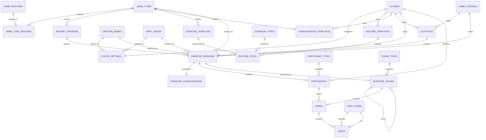

# Database Specification

> **Version:** 2.1.0
>
> This document defines the complete logical and physical data model of the PostgreSQL database.
>
> It serves as the canonical reference for all persistent data used by the application.
>
> Every database table, relationship, ownership rule and lifecycle described in this document maps directly to the SQL migrations contained in the database project (`0001`–`0011`).

---

# Purpose

The database is the authoritative representation of the application's domain.

Its primary responsibilities are:

- storing persistent domain data
- preserving historical gameplay
- enforcing data integrity
- supporting deterministic replay
- enabling future analytics
- providing efficient read models for the API

The data model has been designed to support both the current feature set and future expansion without requiring structural redesign.

---

# Scope

This specification documents:

- all persistent entities
- ownership boundaries
- relationships
- primary keys
- foreign keys
- identifier strategy
- timestamp strategy
- lifecycle rules
- runtime event model
- configuration snapshots
- ruleset versioning

Implementation details such as SQL syntax, indexes and migrations are documented separately.

---

# Architectural Principles

The data model follows several fundamental principles.

## Relational First

The database is normalized by default.

Denormalization is only introduced when performance measurements justify duplication.

---

## Facts Over Calculations

The database stores facts.

Examples:

- thrown darts
- selected targets
- active configurations
- completed sessions

The database does not store values that can be derived from these facts unless explicitly justified.

Examples:

- averages
- percentages
- hit rates
- trends

These are calculated through views or analytical queries.

---

## Historical Accuracy

Completed gameplay is historical truth.

Historical data must never change because:

- a template changed
- a ruleset changed
- application logic changed

Historical replay must always reproduce the original gameplay.

---

## Stable Domain Model

Entities represent business concepts rather than implementation details.

Examples:

- Player
- Activity
- Exercise Session
- Turn
- Dart

The database should never expose frontend-specific concepts.

---

## Explicit Ownership

Every piece of data has exactly one owner.

Ownership prevents duplication and inconsistent state.

---

# Database Layers

The data model is divided into five logical layers.

```
Reference Layer

↓

Player Layer

↓

Template Layer

↓

Runtime Layer

↓

Read Model Layer
```

Each layer has a distinct responsibility.

The Player Layer is small but separate: it bridges external authentication and application-owned data, and both the Template and Runtime layers depend on it.

---

# Reference Layer

Purpose:

Defines controlled system-wide concepts.

Examples:

- game types
- statuses
- dart zones
- participant types
- rulesets

Reference entities are managed by the system.

They rarely change and are reused throughout the database.

Lookup tables use SMALLINT primary keys.

Domain-level reference entities (game types, ruleset versions) use UUIDv7.

---

# Template Layer

Purpose:

Defines reusable configurations.

Examples:

- exercise templates
- routine templates
- routine steps

Templates describe possible future gameplay.

Templates never represent historical gameplay.

Templates remain mutable.

---

# Runtime Layer

Purpose:

Represents actual user activity.

Examples:

- activities
- exercise sessions
- participants
- stages
- turns
- darts

Runtime entities become historical records after completion.

---

# Read Model Layer

Purpose:

Provides optimized query models.

Read models expose stable interfaces for:

- the REST API
- analytics
- replay
- dashboards

Read models are implemented through PostgreSQL views.

---

# Identifier Strategy

Identifiers depend on the entity type.

## Domain Entities

Domain entities use UUIDv7.

Examples:

- players
- activities
- exercise sessions
- turns
- darts
- game types
- ruleset versions

Reasons:

- globally unique
- time ordered
- excellent B-tree locality
- distributed generation

UUIDs are always generated by the application. The database never generates identifiers.

---

## Reference Entities

Controlled lookup entities use SMALLINT.

Examples:

- game statuses
- dart zones
- participant types
- stage types
- capture modes
- input modes
- duration types

Reasons:

- controlled datasets
- limited cardinality
- improved storage efficiency
- faster joins

Seed scripts supply explicit fixed identifiers for every lookup row.

---

# Timestamp Strategy

Every timestamp uses:

```
TIMESTAMPTZ
```

No exceptions.

Standard timestamp columns:

- created_at
- updated_at

Lifecycle timestamps use explicit names.

Examples:

- started_at
- completed_at
- published_at
- archived_at

---

# Ownership Model

Every persistent entity has exactly one owner.

| Entity                  | Owner           |
| ----------------------- | --------------- |
| Authentication Identity | Neon Auth       |
| Player Profile          | Database        |
| Game Definitions        | Reference Layer |
| Templates               | Database        |
| Runtime Events          | Runtime Layer   |
| Statistics              | Read Models     |

Authentication credentials are never stored in the application database.

The database only references external authentication identifiers.

---

# Runtime Event Model

Gameplay is represented as a hierarchy of immutable events.

```
Exercise Session

↓

Exercise Stage

↓

Turn

↓

Dart
```

The dart is the smallest persistent gameplay event.

Every higher-level entity groups lower-level events.

This model enables:

- deterministic replay
- future coaching
- advanced analytics
- historical inspection

---

# Configuration Snapshot Model

Configuration follows a three-stage lifecycle.

```
Template

↓

Configuration Snapshot

↓

Runtime Session
```

Templates may evolve over time.

Snapshots preserve the exact configuration used when gameplay started.

Runtime sessions always reference configuration snapshots rather than mutable templates.

---

# Ruleset Versioning

Every game type owns one or more ruleset versions.

Rulesets are immutable after publication.

Changes always create a new version.

Historical sessions reference the ruleset version that was active when the session started.

Historical gameplay therefore remains reproducible indefinitely.

---

# Relationship Philosophy

The runtime hierarchy is intentionally explicit.

```
Player

↓

Activity

↓

Exercise Session

↓

Participant

↓

Exercise Stage

↓

Turn

↓

Dart
```

Each level owns a distinct responsibility.

Activities group user interactions.

Exercise sessions represent playable instances.

Stages divide gameplay into logical sections.

Turns group the darts thrown during one visit to the oche.

Darts record the smallest gameplay events.

This separation improves replay, analytics and future extensibility.

---

# Reference Layer

## Purpose

The Reference Layer defines the controlled concepts used throughout the application.

Reference data changes infrequently.

It provides stable definitions reused by templates, runtime entities and views.

Reference entities are owned by the application.

Users cannot modify reference data.

---

# Design Principles

Lookup tables must:

- use SMALLINT primary keys
- expose stable implementation keys
- expose human-readable names
- contain only controlled values
- never store user-specific information

Reference entities are seeded through deterministic seed scripts.

Every seed supplies explicit fixed identifiers.

---

# game_types

## Purpose

Defines every supported playable game or exercise.

## Primary Key

UUIDv7

Game types are domain entities, not lookup values. They participate in the domain identifier strategy.

## Key Columns

- id
- implementation_key
- name
- description
- is_published
- created_at
- updated_at

## Relationships

Referenced by:

- ruleset_versions
- exercise_templates
- exercise_sessions

Linked to features through:

- game_type_features

## Design Rationale

Separating game definitions from implementation allows games to be introduced, hidden or published without affecting runtime data.

Seeded game types:

- 501
- TUOD (Ten Up One Down)
- SINGLES_TRAINING
- SCORE_TRAINING

---

# game_features

## Purpose

Defines reusable capabilities supported by game types.

Seeded examples:

- TIMED_MODE
- ROUNDS_MODE
- OPPONENT_SUPPORT
- DARTBOT_SUPPORT
- DOUBLE_OUT

## Primary Key

SMALLINT

## Relationships

Many-to-many with:

- game_types

---

# game_type_features

## Purpose

Associates game types with supported features.

## Primary Key

Composite primary key:

(game_type_id, game_feature_id)

## Relationships

References:

- game_types
- game_features

## Design Rationale

Normalizes feature assignment and allows future expansion without altering game definitions.

---

# game_statuses

## Purpose

Defines the lifecycle states of an activity or exercise session.

## Primary Key

SMALLINT

## Key Columns

- id
- implementation_key
- name
- description
- created_at

## Relationships

Referenced by:

- activities
- exercise_sessions

## Design Rationale

Using a lookup table instead of booleans enables future expansion without schema changes.

Seeded values:

- ACTIVE
- COMPLETED
- ABANDONED

Additional states (for example PAUSED or CANCELLED) can be introduced through new seed rows without schema change.

---

# capture_modes

## Purpose

Defines how much gameplay detail is captured during a session.

Seeded values:

- RECREATIONAL — stores gameplay with minimal required detail
- ANALYTICS — stores detailed dart-level information

## Primary Key

SMALLINT

## Relationships

Referenced by:

- exercise_sessions

## Design Rationale

Capture depth is a per-session fact. Recreational sessions may store turn totals without individual dart rows. Analytics sessions require full intention and result capture for every dart.

---

# input_modes

## Purpose

Defines the user interaction style used to enter gameplay.

Seeded values:

- QUICK_SCORE — fast score entry without individual dart capture
- DETAILED_DARTS — individual dart entry for analytics

## Primary Key

SMALLINT

## Relationships

Referenced by:

- exercise_sessions

## Design Rationale

Input mode is stored on the session so historical data always records how it was captured. Input mode describes interaction; capture mode describes stored detail.

---

# ruleset_versions

## Purpose

Stores immutable rule definitions for each game type.

## Primary Key

UUIDv7

## Key Columns

- id
- game_type_id
- implementation_key
- version_number
- description
- created_at

## Relationships

References:

- game_types

Referenced by:

- exercise_sessions

## Constraints

- (game_type_id, implementation_key) unique
- (game_type_id, version_number) unique

## Design Rationale

Rules evolve through versioning rather than modification.

Historical gameplay references immutable rule versions.

Rulesets own game limits such as maximum darts per turn and score caps. These limits are enforced by the application, not by database CHECK constraints.

---

# dart_zones

## Purpose

Defines every valid dartboard scoring zone.

Seeded values:

- SINGLE
- DOUBLE
- TREBLE
- OUTER_BULL
- INNER_BULL
- MISS

## Primary Key

SMALLINT

## Relationships

Referenced by:

- darts (intended_zone_id and hit_zone_id)

## Design Rationale

Zones make multipliers derivable instead of stored. A dart references the zone it targeted and the zone it hit; scoring meaning is derived from zone plus target number.

---

# participant_types

## Purpose

Defines participant roles within an exercise session.

Seeded values:

- PLAYER
- GUEST
- DARTBOT

## Primary Key

SMALLINT

## Relationships

Referenced by:

- participants

---

# stage_types

## Purpose

Defines the type of stage within an exercise session.

Seeded values:

- MATCH
- SET
- LEG
- ROUND
- EXERCISE_BLOCK

## Primary Key

SMALLINT

## Relationships

Referenced by:

- exercise_stages

## Design Rationale

A controlled lookup keeps the stage hierarchy generic. Game engines decide which stage types they use; the database does not hard-code per-game structures.

---

# duration_types

## Purpose

Defines how an exercise or routine step is measured.

Seeded values:

- ROUNDS
- MINUTES

## Primary Key

SMALLINT

## Relationships

Intended to be referenced by:

- routine_steps

## Design Rationale

Supporting duration through a reference entity allows additional measurement strategies to be introduced without modifying templates.

---

# Reference Layer Summary

The Reference Layer provides stable application definitions.

These entities are:

- immutable after publication where applicable
- centrally managed
- reused throughout the data model
- independent of user data
- optimized using SMALLINT identifiers for lookups and UUIDv7 for domain-level reference entities

The remaining layers build upon these controlled definitions.

---

# Template Layer

## Purpose

The Template Layer defines reusable gameplay definitions.

Templates describe what a player could do.

They never describe what a player did.

Templates are the only mutable layer that users interact with directly.

---

# Design Principles

Template entities must:

- use UUIDv7 primary keys
- distinguish system templates from user templates
- never be referenced by runtime gameplay records
- provide values that runtime copies into configuration snapshots

The runtime layer copies template values at session start.

No runtime table holds a foreign key to a template.

This guarantees that editing or deleting a template can never alter historical gameplay.

---

# exercise_templates

## Purpose

Defines reusable exercise definitions for a specific game type.

Examples:

- Singles accuracy drill
- Score training block
- TUOD standard session

## Ownership

System templates are owned by the application.

User templates are a planned extension; the current schema marks origin through `is_system_template`.

## Lifecycle

Mutable.

Templates may be created, edited and retired at any time without affecting historical sessions.

## Primary Key

UUIDv7

## Key Columns

- id
- game_type_id
- name
- description
- is_system_template
- created_at
- updated_at

## Relationships

References:

- game_types (RESTRICT on delete)

Referenced by:

- routine_steps

## Design Rationale

An exercise template binds a game type to a reusable definition that routines can compose.

Deleting a game type is restricted while templates exist, protecting template integrity.

Runtime sessions never reference this table; they receive copied values through the configuration snapshot.

---

# routine_templates

## Purpose

Defines composed training routines.

Examples:

- Warmup routine
- Doubles routine
- Full practice program

## Ownership

Two categories exist:

- **System routines** — `player_id` is NULL, `is_system_template` is TRUE. Created by the application. Cannot be modified by users.
- **User routines** — `player_id` references the owning player. Created and modified by that player.

## Lifecycle

Mutable.

Deleting a player cascades to their personal routines.

System routines are never deleted by user action.

## Primary Key

UUIDv7

## Key Columns

- id
- player_id (nullable)
- name
- description
- is_system_template
- created_at
- updated_at

## Relationships

References:

- players (CASCADE on delete)

Referenced by:

- routine_steps

## Design Rationale

A nullable `player_id` cleanly separates system content from user content without a second table.

Routines are compositions; the actual exercises live in `routine_steps`.

---

# routine_steps

## Purpose

Defines the ordered exercises inside a routine.

Example:

```
Routine

↓

15 min warmup

↓

15 min singles

↓

20 min scoring

↓

15 min doubles
```

## Ownership

Owned by the parent routine template.

## Lifecycle

Mutable.

Steps live and die with their routine (CASCADE).

Referenced exercise templates are protected (RESTRICT) while steps use them.

## Primary Key

UUIDv7

## Key Columns

- id
- routine_template_id
- exercise_template_id
- sequence_number
- duration_type
- duration_value
- created_at

## Relationships

References:

- routine_templates (CASCADE on delete)
- exercise_templates (RESTRICT on delete)

## Design Rationale

Steps are the composition mechanism: a routine is an ordered list of exercise references, each with its own duration.

`sequence_number` defines execution order explicitly rather than relying on insertion order.

---

# configuration_templates (migration 0010)

## Purpose

Stores reusable, named configuration presets for a game type.

Examples:

- "501 — Best of 5, Double Out"
- "TUOD — 10 minutes, standard difficulty"
- "Singles — Hard, random order"

## Ownership

System presets are owned by the application.

User presets are owned by the creating player.

## Lifecycle

Mutable, like all templates.

Runtime never references this table; values are copied into the configuration snapshot at session start.

## Primary Key

UUIDv7

## Key Columns

- id
- game_type_id
- player_id (nullable — NULL for system presets)
- name
- description
- configuration (JSONB)
- is_system_template
- created_at
- updated_at

## Relationships

References:

- game_types (RESTRICT on delete)
- players (CASCADE on delete)

## Design Rationale

The configuration chain is Template → Snapshot → Session. This table stores named presets that are copied into `exercise_configurations` at session start.

The JSONB `configuration` column mirrors `exercise_configurations.configuration`: the snapshot is created by copying (and possibly overriding) the preset JSONB.

Seeded by `0002_default_templates.sql`.

A CHECK constraint guarantees system presets never belong to a player (`is_system_template` implies `player_id IS NULL`).

> **Status:** implemented in migration `0010_configuration_templates.sql`.

---

# Template ↔ Runtime Boundary

The most important rule of the Template Layer:

```
Templates are read at session start.

Values are copied into the configuration snapshot.

Runtime never references templates.
```

Consequences:

- editing a template never changes history
- deleting a user routine never orphans gameplay records
- replay depends only on runtime data

---


# Template Layer Summary

The Template Layer provides mutable, reusable gameplay definitions.

These entities are:

- user-facing and editable
- composed (routines contain ordered steps referencing exercises)
- copied into runtime snapshots, never referenced by runtime
- split into system content and user content through `is_system_template` and nullable ownership

The Runtime Layer records what actually happened when these definitions are executed.

---

# Player Layer

## Purpose

The Player Layer bridges external authentication and application-owned data.

Authentication is handled by Neon Auth.

The database never stores credentials.

It stores the application profile and preferences linked to an external identity.

---

# players

## Purpose

Represents a player inside the application.

## Ownership

Owned by the database.

The authentication identity behind it is owned by Neon Auth.

## Lifecycle

Mutable profile data.

Deleting a player cascades to settings, activities and personal templates.

## Primary Key

UUIDv7

## Key Columns

- id
- auth_user_id (unique — external identity reference)
- display_name
- created_at
- updated_at

## Relationships

Referenced by:

- player_settings
- activities
- exercise_sessions
- participants
- routine_templates

## Design Rationale

`display_name` is a configurable nickname (for example "The Power"). It is intentionally **not unique** — it represents persona, not identity.

`auth_user_id` is the only link to the authentication system. Swapping the auth provider would only affect this column.

---

# player_settings

## Purpose

Stores player preferences.

Examples:

- default capture mode
- default input mode

## Ownership

Owned by the player.

## Lifecycle

Mutable.

Settings are **defaults only** — they are read at session start and copied onto the session. They never represent history.

## Primary Key

Shared primary key:

`player_id` is both primary key and foreign key to `players`.

## Key Columns

- player_id
- default_capture_mode_id
- default_input_mode_id
- created_at
- updated_at

## Relationships

References:

- players (CASCADE on delete)
- capture_modes
- input_modes

## Design Rationale

The shared primary key enforces a strict 1:1 relationship without an extra identifier.

Changing a default never rewrites history because sessions store the actual values used.

---

# Runtime Layer

## Purpose

The Runtime Layer stores what actually happened.

Runtime data is the historical truth of the application.

Every statistic, replay and analysis is derived from this layer.

---

# Design Principles

Runtime entities must:

- use UUIDv7 primary keys
- record actual values, never references to mutable definitions
- remain mutable only while a session is active
- become immutable once the session is COMPLETED
- form an explicit hierarchy with no polymorphic foreign keys

The hierarchy is:

```
Activity

↓

Exercise Session

↓

Exercise Stage (hierarchical)

↓

Turn

↓

Dart
```

Participants attach to the exercise session.

---

# activities

## Purpose

Represents a user interaction lifecycle — the "why is the player playing?" container.

Example:

```
User opens app

Starts TUOD

Closes browser

Activity remains recoverable
```

## Ownership

Owned by the player.

## Lifecycle

ACTIVE → COMPLETED or ABANDONED.

Supports browser refresh recovery and abandoned session detection.

## Primary Key

UUIDv7

## Key Columns

- id
- player_id
- status_id
- started_at
- completed_at (nullable)
- created_at

## Relationships

References:

- players (CASCADE on delete)
- game_statuses (RESTRICT on delete)

Referenced by:

- exercise_sessions

## Constraints

- completed_at must be after started_at when present

## Design Rationale

Activities separate application usage from gameplay execution.

One activity can contain multiple exercise sessions (for example a routine run executing several exercises).

---

# exercise_sessions

## Purpose

Represents an actual played game or exercise — the "which engine is active?" record.

## Ownership

Owned by the player, grouped under an activity.

## Lifecycle

Mutable during play.

Immutable after COMPLETED.

## Primary Key

UUIDv7

## Key Columns

- id
- activity_id
- player_id
- game_type_id
- capture_mode_id
- input_mode_id
- status_id
- ruleset_version_id
- started_at
- completed_at (nullable)
- created_at

## Relationships

References:

- activities (CASCADE)
- players (CASCADE)
- game_types (RESTRICT)
- capture_modes (RESTRICT)
- input_modes (RESTRICT)
- game_statuses (RESTRICT)
- ruleset_versions (RESTRICT)

Referenced by:

- exercise_configurations
- participants
- exercise_stages

## Constraints

- completed_at must be after started_at when present

## Rules

A player can have only one active exercise session per game type.

## Design Rationale

The session stores the actual capture mode, input mode and ruleset version used — copied from settings and templates at start.

This makes every session self-describing: replay needs nothing outside the runtime layer.

The direct `player_id` reference (alongside `activity_id`) is a deliberate, controlled denormalisation for query efficiency on the most common access path.

---

# exercise_configurations

## Purpose

Stores the immutable configuration snapshot used during execution.

## Ownership

Owned by the exercise session.

## Lifecycle

Written once at session start.

Never updated.

## Primary Key

UUIDv7

## Key Columns

- id
- exercise_session_id (unique)
- configuration (JSONB)
- created_at

## Relationships

References:

- exercise_sessions (CASCADE, 1:1 via unique constraint)

## Constraints

- configuration must be a JSON object

## Design Rationale

Templates may change; historical execution must not.

The snapshot is a JSONB copy of the effective configuration (preset values plus any per-session overrides).

The structure of the JSONB is defined per game type by the ruleset version. The application validates it; the database only guarantees it is a JSON object.

JSONB was chosen over typed per-game child tables because the configuration is written once, read for replay, and never queried relationally. This resolves the earlier typed-vs-JSONB tension in favour of JSONB for snapshots.

---

# participants

## Purpose

Represents who or what took part in a session.

Examples:

- the player
- a guest opponent
- DartBot

## Ownership

Owned by the exercise session.

## Lifecycle

Created at session start.

Immutable after session completion.

## Primary Key

UUIDv7

## Key Columns

- id
- exercise_session_id
- participant_type_id
- player_id (nullable)
- display_name
- created_at

## Relationships

References:

- exercise_sessions (CASCADE)
- participant_types (RESTRICT)
- players (RESTRICT, optional)

Referenced by:

- turns

## Constraints

- display_name is always populated at write time to make replay labels deterministic
- participant_type_id = PLAYER => display_name = players.display_name
- participant_type_id = GUEST => display_name = guest-chosen name
- participant_type_id = DARTBOT => display_name = 'DartBot'

## Design Rationale

Participants belong to the exercise session, not the activity, because opposition is a property of a specific game.

Guest identity is minimal by design: only outcome relevance is required, not account creation.

Replay labels use persisted `display_name`, so replay output does not depend on nullable labels or later player-profile edits.

---

# session_write_idempotency

## Purpose

Stores persisted outcomes for `POST /api/sessions/:sessionId/events:batch` so the API can honor idempotent retries.

## Ownership

Owned by the exercise-session write path (Runtime Layer).

## Lifecycle

Written when a batch-write request is accepted for persistence.

Historical records are immutable once stored.

## Primary Key

UUIDv7

## Key Columns

- id
- session_id
- idempotency_key
- normalized_payload_hash
- result
- created_at

## Relationships

References:

- exercise_sessions (CASCADE)

## Constraints

- (session_id, idempotency_key) must be unique
- result must be a JSON object

## Design Rationale

The API contract defines idempotency behavior for batch writes. Persisting the stored result keyed by `(session_id, idempotency_key)` allows the server to return the prior outcome for matching payload hashes and reject conflicting payload reuse.

---

# exercise_stages

## Purpose

Represents hierarchical subdivisions of gameplay.

Examples:

501:

```
Match

  Set

    Leg
```

Routine:

```
Exercise block
```

## Ownership

Owned by the exercise session.

## Lifecycle

Created as gameplay progresses.

Immutable after session completion.

## Primary Key

UUIDv7

## Key Columns

- id
- exercise_session_id
- parent_stage_id (nullable, self-reference)
- stage_type_id
- sequence_number
- created_at

## Relationships

References:

- exercise_sessions (CASCADE)
- exercise_stages (self, CASCADE)
- stage_types (RESTRICT)

Referenced by:

- turns

## Constraints

- sequence_number must be positive
- a stage cannot be its own parent

## Rules

The current stage is never stored — it is derived from the latest stage, turn and dart.

## Design Rationale

A single generic hierarchy with typed stages supports every game structure (sets/legs, rounds, exercise blocks) without per-game stage tables.

Game engines decide which stage types they create; the database stays game-agnostic.

---

# turns

## Purpose

Represents one visit to the oche.

## Ownership

Owned by an exercise stage, thrown by a participant.

## Lifecycle

Created when the visit starts.

`completed_at` NULL means the turn was interrupted mid-visit — this is how resumable games recover position.

Immutable after session completion.

## Primary Key

UUIDv7

## Key Columns

- id
- exercise_stage_id
- participant_id
- sequence_number
- total_score
- completed_at (nullable)
- created_at

## Relationships

References:

- exercise_stages (CASCADE)
- participants (RESTRICT)

Referenced by:

- darts

## Constraints

- sequence_number must be positive
- completed_at must be after created_at when present

## Rules

The maximum number of darts per turn is owned by the ruleset, not by a database constraint.

## Design Rationale

`total_score` is a controlled denormalisation: it duplicates the sum of dart scores so recreational sessions can store turn totals **without any dart rows**, and so common queries avoid aggregating darts.

The application is the only writer and keeps `total_score` consistent with dart rows when they exist.

---

# darts

## Purpose

Stores individual dart events — the atomic analytical fact.

One row = one thrown dart.

## Ownership

Owned by the turn.

## Lifecycle

Written as thrown.

Immutable after session completion.

## Primary Key

UUIDv7

## Key Columns

- id
- turn_id
- dart_number
- intended_target_number (nullable)
- intended_zone_id (nullable)
- hit_target_number (nullable)
- hit_zone_id (nullable)
- score
- created_at

## Relationships

References:

- turns (CASCADE)
- dart_zones (intended and hit, RESTRICT)

## Constraints

- dart_number must be positive
- score must be zero or positive
- target numbers must be between 1 and 25 when present
- intention consistency: a target number requires a zone
- hit consistency: a target number requires a zone

## Rules

Capture depth follows the session's capture mode:

- RECREATIONAL — dart rows may be omitted entirely (turn totals only)
- ANALYTICS — every dart stores full intention and result

## Design Rationale

The intention + result pair is the analytical core of the entire platform:

- intended vs hit zone → accuracy
- intended vs hit target → miss direction tendencies
- zone joins → double/treble performance

There is **no multiplier column** — the multiplier is derived from the zone. Storing it would duplicate truth.

`location_x` / `location_y` board coordinates are deferred: the current schema does not define these columns, and they may be added in a future schema revision when the UI can capture them.

---

# Runtime Immutability Boundary

After a session reaches COMPLETED, the following must never change:

- darts
- turns
- stages
- participants
- configuration snapshot
- ruleset reference

Corrections are new records, never updates.
This immutability is application-enforced in the current architecture; the documentation does not assume database-side triggers or workflow enforcement.

Active sessions remain mutable — interrupted turns are completed, stages are appended, scores accumulate.

---


# Runtime Layer Summary

The Runtime Layer is the factual heart of the database.

Its entities:

- form an explicit, non-polymorphic hierarchy
- store actual values, never template references
- support partial capture (recreational) and full capture (analytics)
- become immutable historical truth at completion
- contain everything required for deterministic replay

The Read Model Layer exposes this truth through stable query interfaces.

---

# Read Model Layer

## Purpose

The Read Model Layer provides stable, optimized query interfaces on top of the runtime truth.

Read models are implemented as PostgreSQL views.

The API consumes views — never raw tables.

---

# Design Principles

Read models must:

- expose `implementation_key` values alongside identifiers
- hide relational complexity from consumers
- contain no business logic beyond joining and labelling facts
- never introduce new truth
- remain stable contracts — structural changes are breaking changes

Views are divided into three categories (defined in `05-Views.md`):

1. **API Read Models** — application-facing structures
2. **Replay Views** — deterministic gameplay reconstruction
3. **Analytics Views** — derived performance insights

Migration `0009` delivers the initial five views. Future analytics views are described under Future Expansion.

---

# v_active_sessions

## Category

API Read Model

## Purpose

Lists sessions available for resume.

Used by application startup and browser refresh recovery.

## Sources

- exercise_sessions
- game_types
- capture_modes
- input_modes
- game_statuses (filter: ACTIVE)

## Exposes

Session identity, player, game type (id + key + name), capture mode, input mode, ruleset version, start time.

## Design Rationale

Resume is the most latency-sensitive read path. The view pre-joins every label the UI needs so recovery requires a single query.

The filter uses the status `implementation_key`, not a hard-coded numeric id.

---

# v_session_overview

## Category

API Read Model

## Purpose

High-level gameplay history for list screens.

## Sources

- exercise_sessions
- game_types
- game_statuses
- capture_modes

## Exposes

Session identity, game labels, status, capture mode, start/completion times and a computed `duration_seconds`.

## Design Rationale

`duration_seconds` is derived at query time (`completed_at − started_at`, falling back to `now()` for running sessions). It is presentation logic, not stored truth — consistent with Facts Over Calculations.

---

# v_game_replay

## Category

Replay View

## Purpose

Reconstructs the exact gameplay sequence of a session.

## Sources

- exercise_sessions
- exercise_stages + stage_types
- turns
- participants
- darts
- dart_zones (intended and hit, LEFT JOIN)

## Exposes

Stage sequence and type, turn sequence, participant, dart number, intended target/zone, hit target/zone, score.

## Design Rationale

Ordering columns (stage sequence, turn sequence, dart number) let the consumer replay events chronologically.

Zone joins are LEFT JOINs because recreational capture may omit intention and result detail.

Replay depends only on runtime data — never on current templates or rulesets.

---

# v_dart_analytics

## Category

Analytics View

## Purpose

Intention-complete, analytics-ready dart dataset.

## Sources

- darts → turns → exercise_stages → exercise_sessions → game_types
- dart_zones (intended and hit, LEFT JOIN)

## Exposes

Player, game type, intended target/zone, hit target/zone, score, and a computed `exact_hit` flag (intended target and zone both match the hit).

## Design Rationale

This is the foundation dataset for every accuracy statistic: double hit rates, miss tendencies, intended-vs-hit matrices.
`v_dart_analytics` is intentionally narrower than raw dart history: it includes only darts where both `intended_target_number` and `intended_zone_id` are present so accuracy and miss-intent analysis has complete intention data.

`exact_hit` is a derived convenience flag, not stored truth.

---

# v_routine_execution

## Category

API Read Model

## Purpose

Shows the ordered exercises of a routine for execution.

## Sources

- routine_templates
- routine_steps
- exercise_templates
- game_types
- duration_types

## Exposes

Routine identity and name, step sequence, exercise identity and name, game type key, duration value and duration type key.

## Design Rationale

The frontend renders and executes a routine from this single view without touching template tables.

---

# Read Model Layer Summary

The initial read models cover the three core read paths:

| Path | View |
| ---- | ---- |
| Resume | v_active_sessions |
| History | v_session_overview, v_game_replay |
| Analytics | v_dart_analytics |
| Routine execution | v_routine_execution |

New statistics are delivered as new views — never as stored aggregates.

---

# Relationship Matrix

| Table | References | Referenced by |
| ----- | ---------- | ------------- |
| game_types | — | game_type_features, ruleset_versions, exercise_templates, exercise_sessions, configuration_templates |
| game_features | — | game_type_features |
| game_type_features | game_types, game_features | — |
| game_statuses | — | activities, exercise_sessions |
| capture_modes | — | player_settings, exercise_sessions |
| input_modes | — | player_settings, exercise_sessions |
| duration_types | — | routine_steps |
| participant_types | — | participants |
| stage_types | — | exercise_stages |
| dart_zones | — | darts (intended + hit) |
| ruleset_versions | game_types | exercise_sessions |
| players | — | player_settings, activities, exercise_sessions, participants, routine_templates, configuration_templates |
| player_settings | players, capture_modes, input_modes | — |
| exercise_templates | game_types | routine_steps |
| routine_templates | players | routine_steps |
| routine_steps | routine_templates, exercise_templates, duration_types | — |
| configuration_templates | game_types, players | — |
| activities | players, game_statuses | exercise_sessions |
| exercise_sessions | activities, players, game_types, capture_modes, input_modes, game_statuses, ruleset_versions | exercise_configurations, participants, exercise_stages |
| exercise_configurations | exercise_sessions | — |
| participants | exercise_sessions, participant_types, players | turns |
| exercise_stages | exercise_sessions, exercise_stages (self), stage_types | turns |
| turns | exercise_stages, participants | darts |
| darts | turns, dart_zones (×2) | — |

Deliberate absences:

- No runtime table references a template table.
- No polymorphic foreign keys exist anywhere.
- Views reference tables; nothing references views.

---

# Complete Entity Relationship Diagram



`CONFIGURATION_TEMPLATES` is created by migration `0010`.

---

# Future Expansion

The model supports growth without structural redesign.

## New Games

Adding a game requires only additive steps:

1. new `game_types` row
2. feature mappings
3. a `ruleset_versions` row with its configuration schema
4. configuration template presets
5. game-specific analytics views
6. a frontend engine

No existing table changes.

## Analytics Views

Planned derived views (all computable from existing facts):

- 3-dart and first-9 averages
- checkout and double hit percentages
- 180s / 140+ / ton counts
- rolling averages and monthly progression
- miss tendency analysis (requires future `location_x` / `location_y` capture)
- clutch performance and recovery metrics

Materialized views are introduced only when measured query cost justifies them.

## Multi-User and Teams

Possible additions:

- `teams`, `team_members`
- `matches`, `match_participants`

Runtime events remain unchanged; new entities compose around them.

## Event Sourcing

The event-shaped runtime hierarchy (session → stage → turn → dart) allows a future append-only event log without remodelling gameplay.

---

# Architectural Decisions Summary

| Decision | Choice | Rationale |
| -------- | ------ | --------- |
| Identifier strategy | UUIDv7 (domain) + SMALLINT (lookups), app-generated | Time-ordered, distributed, efficient joins |
| Configuration storage | JSONB preset + JSONB snapshot | Written once, read for replay, never queried relationally |
| Template ↔ runtime coupling | Copy, never reference | Historical accuracy independent of template edits |
| Ruleset changes | New version, never mutation | Deterministic replay forever |
| Multiplier on darts | Not stored — derived from zone | Single source of truth |
| Turn totals | Controlled denormalisation (`total_score`) | Recreational capture without dart rows; cheap aggregates |
| Game limits (max darts, caps) | Ruleset-owned, application-enforced | Rules vary per game; schema stays generic |
| Stage modelling | One generic hierarchy + stage_types | No per-game stage tables |
| Statistics | Views only | No stored derivable values |
| Current stage tracking | Derived, never stored | No duplicated state to keep consistent |

---

# Final Principle

The database captures reality at the highest useful resolution.

Games are not stored as final scores.

Games are stored as events.

Statistics are interpretations of those events.

This creates a foundation that can evolve without losing historical correctness.
