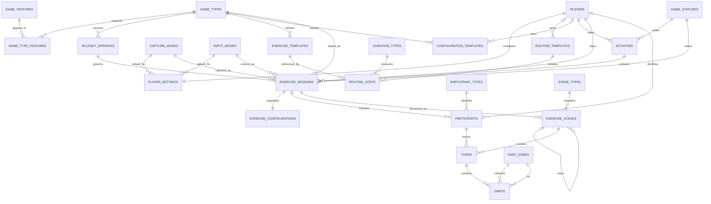

<!--
status: canonical
scope: database/cross-layer
read-when: relationship matrix, full ERD, future expansion, decision summary
updated: 2026-07-11
-->

# Database Specification — Chapter 6: Relationships and Evolution

> Part of the canonical Database Specification (v2.2.0). Cross-layer invariants (identifier/timestamp strategy, ownership model, runtime event and configuration snapshot models) live in `../06-Database-Specification.md`. Content moved verbatim from the v2.1.0 monolith on 2026-07-11.

---

# Relationship Matrix

| Table | References | Referenced by |
| ----- | ---------- | ------------- |
| game_types | — | game_type_features, ruleset_versions, exercise_templates, exercise_sessions, configuration_templates |
| game_features | — | game_type_features |
| game_type_features | game_types, game_features | — |
| game_statuses | — | activities, exercise_sessions |
| capture_modes | — | player_settings, exercise_sessions |
| input_modes | — | player_settings, exercise_sessions |
| duration_types | — | routine_steps |
| participant_types | — | participants |
| stage_types | — | exercise_stages |
| dart_zones | — | darts (intended + hit) |
| ruleset_versions | game_types | exercise_sessions |
| players | — | player_settings, activities, exercise_sessions, participants, routine_templates, configuration_templates |
| player_settings | players, capture_modes, input_modes | — |
| exercise_templates | game_types | routine_steps |
| routine_templates | players | routine_steps |
| routine_steps | routine_templates, exercise_templates, duration_types | — |
| configuration_templates | game_types, players | — |
| activities | players, game_statuses | exercise_sessions |
| exercise_sessions | activities, players, game_types, capture_modes, input_modes, game_statuses, ruleset_versions | exercise_configurations, participants, exercise_stages |
| exercise_configurations | exercise_sessions | — |
| participants | exercise_sessions, participant_types, players | turns |
| exercise_stages | exercise_sessions, exercise_stages (self), stage_types | turns |
| turns | exercise_stages, participants | darts |
| darts | turns, dart_zones (×2) | — |

Deliberate absences:

- No runtime table references a template table.
- No polymorphic foreign keys exist anywhere.
- Views reference tables; nothing references views.

---

# Complete Entity Relationship Diagram

`CONFIGURATION_TEMPLATES` is created by migration `0010`.

---

# Future Expansion

The model supports growth without structural redesign.

## New Games

Adding a game requires only additive steps:

1. new `game_types` row
2. feature mappings
3. a `ruleset_versions` row with its configuration schema
4. configuration template presets
5. game-specific analytics views
6. a frontend engine

No existing table changes.

## Analytics Views

Planned derived views (all computable from existing facts):

- 3-dart and first-9 averages
- checkout and double hit percentages
- 180s / 140+ / ton counts
- rolling averages and monthly progression
- miss tendency analysis (requires future `location_x` / `location_y` capture)
- clutch performance and recovery metrics

Materialized views are introduced only when measured query cost justifies them.

## Multi-User and Teams

Possible additions:

- `teams`, `team_members`
- `matches`, `match_participants`

Runtime events remain unchanged; new entities compose around them.

## Event Sourcing

The event-shaped runtime hierarchy (session → stage → turn → dart) allows a future append-only event log without remodelling gameplay.

---

# Architectural Decisions Summary

| Decision | Choice | Rationale |
| -------- | ------ | --------- |
| Identifier strategy | UUIDv7 (domain) + SMALLINT (lookups), app-generated | Time-ordered, distributed, efficient joins |
| Configuration storage | JSONB preset + JSONB snapshot | Written once, read for replay, never queried relationally |
| Template ↔ runtime coupling | Copy, never reference | Historical accuracy independent of template edits |
| Ruleset changes | New version, never mutation | Deterministic replay forever |
| Multiplier on darts | Not stored — derived from zone | Single source of truth |
| Turn totals | Controlled denormalisation (`total_score`) | Recreational capture without dart rows; cheap aggregates |
| Game limits (max darts, caps) | Ruleset-owned, application-enforced | Rules vary per game; schema stays generic |
| Stage modelling | One generic hierarchy + stage_types | No per-game stage tables |
| Statistics | Views only | No stored derivable values |
| Current stage tracking | Derived, never stored | No duplicated state to keep consistent |

---

# Final Principle

The database captures reality at the highest useful resolution.

Games are not stored as final scores.

Games are stored as events.

Statistics are interpretations of those events.

This creates a foundation that can evolve without losing historical correctness.
