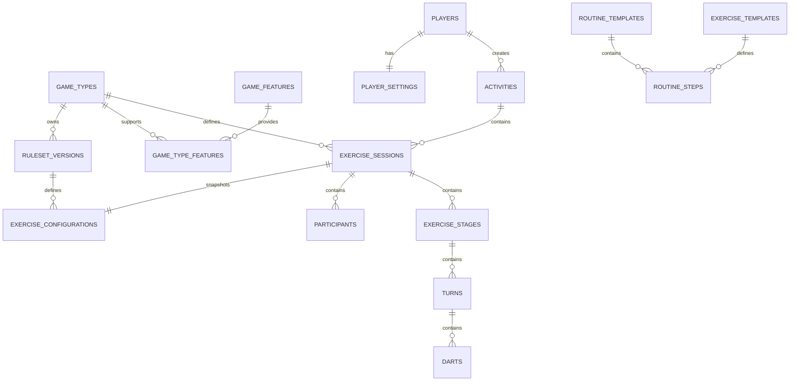

<!--
status: historical
scope: database/design-gate
read-when: decision archaeology only
updated: 2026-07-11
-->

# Physical Schema Mapping

> **Version:** 1.0.1
>
> **Status: HISTORICAL RECORD.** This mapping guided the initial generation of migrations `0001`–`0009`. The migrations themselves and `06-Database-Specification.md` are now the canonical sources; this document is preserved as the design lineage.
>
> This document maps the approved logical data model to the physical PostgreSQL implementation.
>
> It defines:
>
> - table ownership
> - PostgreSQL representation
> - primary keys
> - foreign keys
> - relationship implementation
> - migration ordering

---

# Superseded Decisions

The following details evolved during implementation and differ from this mapping:

| This mapping | Final implementation |
| ------------ | -------------------- |
| Dart columns include `target_number`, `multiplier`, `result_type` | Intention + result model with `dart_zones` FKs; no multiplier or result_type columns |
| Turn columns include `score`, `player_participant_id` | `total_score`, `participant_id`, `completed_at` |
| All primary keys UUIDv7 | Hybrid: UUIDv7 domain / SMALLINT lookups with explicit seeded ids |
| Migration chain ends at `0009_views` | Chain extended: `0010_configuration_templates`, `0011_ordering_and_uniqueness` |
| Stage column `stage_type` | `stage_type_id` FK to `stage_types` lookup |

---

# Purpose

The logical data model describes:

```
What exists?
```

The physical schema defines:

```
How PostgreSQL stores it.
```

The mapping must preserve:

- domain correctness
- historical integrity
- extensibility
- query performance

---

# PostgreSQL Standards

The database follows:

## Primary keys

```
UUIDv7
```

---

## Timestamps

Always:

```
TIMESTAMPTZ
```

---

## Naming

All identifiers follow:

```
snake_case
```

---

## Foreign keys

Use:

```
<entity>_id
```

---

# Schema Organization

Initial implementation uses:

```
public
```

schema.

Future separation may introduce:

```
reference

template

runtime

analytics
```

when complexity justifies it.

---

# Layer Mapping

```
Reference Layer

↓

Template Layer

↓

Runtime Layer

↓

Analytics Layer
```

---

# Reference Layer Tables

---

# game_types

## Purpose

Defines available games.

---

## Table

```
game_types
```

---

## Columns

| Column             | Type        | Description              |
| ------------------ | ----------- | ------------------------ |
| id                 | UUID        | Primary key              |
| implementation_key | TEXT        | Stable system identifier |
| name               | TEXT        | Display name             |
| description        | TEXT        | Explanation              |
| is_published       | BOOLEAN     | Available in production  |
| created_at         | TIMESTAMPTZ | Creation time            |
| updated_at         | TIMESTAMPTZ | Last update              |

---

## Constraints

Unique:

```
implementation_key
```

---

# game_features

## Purpose

Defines supported capabilities.

Examples:

- timed
- rounds
- opponents
- bots

---

# game_type_features

## Purpose

Many-to-many relationship.

---

Relationship:

```
game_types

N

|

N

game_features
```

---

Primary key:

```
(id)
```

or composite:

```
(game_type_id, feature_id)
```

---

Decision:

Use composite key.

Reason:

The relationship itself is the entity.

---

# game_statuses

## Purpose

Lifecycle states.

---

Examples:

```
ACTIVE

COMPLETED

ABANDONED
```

---

# ruleset_versions

## Purpose

Immutable rule definitions.

---

Important because:

```
Rules change.

History cannot.
```

---

Columns:

```
id

game_type_id

version_number

implementation_key

created_at
```

---

# Player Layer Tables

---

# players

## Purpose

Application-owned player profile.

Authentication remains external.

---

Columns:

```
id

display_name

created_at

updated_at
```

---

# player_settings

## Purpose

Stores preferences.

---

Relationship:

```
players

1

|

1

player_settings
```

---

Implementation:

Shared primary key.

```
id REFERENCES players(id)
```

---

# Template Layer Tables

---

# routine_templates

## Purpose

Reusable routines.

---

Columns:

```
id

player_id nullable

name

description

is_system_template

created_at

updated_at
```

---

## Ownership

System routines:

```
player_id = NULL
```

User routines:

```
player_id = user
```

---

# routine_steps

## Purpose

Ordered routine composition.

---

Columns:

```
id

routine_template_id

sequence_number

exercise_template_id

duration_type

duration_value
```

---

# exercise_templates

## Purpose

Reusable exercises.

---

Examples:

```
Singles accuracy

Double practice

Score training
```

---

# game_configurations

## Purpose

Base configuration snapshot.

---

This table contains shared information only.

---

Columns:

```
id

game_type_id

created_at
```

---

Game-specific configuration is stored separately.

---

# Game Specific Configuration Tables

---

# 501_configurations

Purpose:

Stores 501-specific rules.

Example:

```
legs

sets

double_out
```

---

Relationship:

```
exercise_configuration

1

|

1

501_configuration
```

---

Implementation:

Shared primary key.

---

# tuod_configurations

Stores:

```
starting_target

increase_amount

decrease_amount

difficulty
```

---

# singles_configurations

Stores:

```
direction

difficulty

mandatory_hits
```

---

# Runtime Layer Tables

---

# activities

## Purpose

Application usage lifecycle.

---

Columns:

```
id

player_id

status_id

started_at

completed_at

created_at
```

---

# exercise_sessions

## Purpose

Actual executed gameplay.

---

Columns:

```
id

activity_id

player_id

game_type_id

capture_mode_id

status_id

started_at

completed_at

created_at
```

---

# exercise_configurations

## Purpose

Immutable runtime snapshot.

---

Columns:

```
id

exercise_session_id

ruleset_version_id

configuration_json

created_at
```

---

## Reason for snapshot

Templates can change.

History cannot.

---

# participants

## Purpose

Session participants.

---

Columns:

```
id

exercise_session_id

participant_type

player_id nullable

display_name nullable
```

---

Examples:

Player:

```
participant_type = PLAYER
```

Guest:

```
participant_type = GUEST
```

Bot:

```
participant_type = DARTBOT
```

---

# exercise_stages

## Purpose

Represents logical game subdivisions.

---

Examples:

501:

```
leg

set
```

Routine:

```
exercise block
```

---

Columns:

```
id

exercise_session_id

sequence_number

stage_type
```

---

# turns

## Purpose

One visit to the oche.

---

Columns:

```
id

exercise_stage_id

sequence_number

player_participant_id

score
```

---

# darts

## Purpose

Atomic performance event.

---

Columns:

```
id

turn_id

dart_number

target_number

multiplier

score

result_type

created_at
```

---

# Relationship Summary



---

# Migration Order

The migration sequence should be:

```
0001_extensions

↓

0002_reference_tables

↓

0003_players

↓

0004_game_definitions

↓

0005_templates

↓

0006_runtime_core

↓

0007_runtime_events

↓

0008_constraints

↓

0009_indexes

↓

0010_views

↓

0011_seed_reference_data
```

---

# Implementation Decisions

## UUIDv7 Everywhere

Reason:

- distributed generation
- ordering
- future scalability

---

## Shared Primary Keys

Used for:

- one-to-one relationships
- owned configuration extensions

Examples:

```
player_settings

501_configuration
```

---

## Composite Keys

Used where the relationship itself has no independent identity.

Example:

```
game_type_features
```

---

# Pre-SQL Validation Checklist

Before creating migrations:

- all entities have ownership
- all relationships are defined
- all foreign keys are known
- all historical dependencies are clear
- configuration snapshots exist
- game extensions are possible
- analytics can derive required metrics

---

# Final Principle

The physical schema is an implementation of the domain model.

The database should not force the application to become complicated.

The schema should make the correct behaviour the easiest behaviour.
