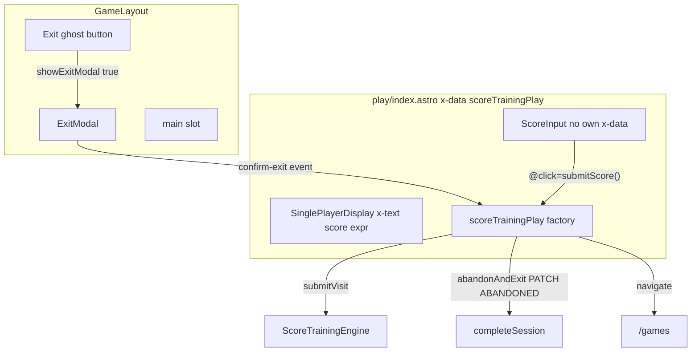

# Score Training Play UI — Design

> **Date:** 2026-07-21
> **Status:** approved (brainstorming consensus)
> **Scope:** `GameLayout`, `ExitModal`, Alpine-wired `ScoreInput` / `SinglePlayerDisplay`, play-page integration, in-game abandon flow.
> **Prerequisite:** `2026-07-17-score-training-flow-redesign.md` (session lifecycle, results modal, D88 reconciliation).
> **Out of scope:** `SinglePlayerDisplay` `progress` slot content, keyboard roving tabindex on exit modal, batch upload of partial turns on abandon.

---

## Context

Score Training play (`app/src/pages/games/score-training/play/index.astro`) still uses `AppLayout` (with bottom nav), a plain `Input` + submit button, and inline running-total text. New game components exist under `components/layout/games/` but are not wired:

| Component | Today | Problem |
| --------- | ----- | ------- |
| `ScoreInput.astro` | Isolated inline `x-data` + local `score` | Does not connect to `scoreTrainingPlay()` |
| `SinglePlayerDisplay.astro` | Static Astro props | Running total is Alpine runtime state |
| `AppLayout.astro` | Always renders `BottomNav` | Bottom nav must never appear during gameplay |

Brainstorming decisions:

| Topic | Choice |
| ----- | ------ |
| Layout | New `GameLayout.astro` — no `BottomNav`, exit chrome + confirm modal |
| Exit modal | Extracted `ExitModal.astro` component |
| Post-exit destination | `/games` |
| `SinglePlayerDisplay` primary value | Running total (`sum of turns`), label `"Score"` |
| `SinglePlayerDisplay` API | Alpine expression string via `score` prop → `x-text={score}`; keep `isTarget` boolean |
| `ScoreInput` integration | No own `x-data`; lives inside parent factory scope; accepts `click` prop for submit action |
| Abandon on confirm | `PATCH ABANDONED` immediately — no events batch for partial turns |

Authority: `07-Frontend/05-Astro-Components.md`, `07-Frontend/07-Style-Guide.md`, `03-Alpine-Patterns.md`, `2026-07-17-score-training-flow-redesign.md`.

---

## Scope

In scope:

- `app/src/layouts/GameLayout.astro` (new)
- `app/src/components/layout/games/ExitModal.astro` (new)
- Refactor `ScoreInput.astro` — remove inline `x-data`; accept `click` prop for submit action
- Refactor `SinglePlayerDisplay.astro` — `score` as Alpine expression string prop
- Wire `app/src/pages/games/score-training/play/index.astro` to `GameLayout`, `ScoreInput`, `SinglePlayerDisplay`
- Add `abandonAndExit()` (or `abandonSession()`) to `scoreTrainingPlay()` factory + types
- Unit tests for abandon method in `score-training-play.data.test.ts`
- `DECISIONS.md` one-liner for `GameLayout` / in-game abandon pattern

Out of scope:

- `progress` slot population on `SinglePlayerDisplay`
- Replacing the existing results modal on play (unchanged)
- Setup page layout changes (stays on `AppLayout`)
- Shared abandon helper extraction from setup factory (optional follow-up; duplicate minimal logic is acceptable for now)
- Vitest for `.astro` markup (D101)

---

## Architecture



Event wiring:

| Interaction | Mechanism | Action |
| ----------- | --------- | ------ |
| Exit confirm | `$dispatch('confirm-exit')` → `@confirm-exit.window` on play root | `abandonAndExit()` |
| Score submit | `ScoreInput` submit button calls factory method directly (lives in parent scope) | `submitScore()` on factory |

---

## Design

### `ExitModal.astro`

`app/src/components/layout/games/ExitModal.astro`

Presentational dialog fragment. Expects parent scope to provide `showExitModal` (boolean).

- `role="dialog"`, `aria-modal="true"`, `aria-labelledby="exit-modal-title"`
- Backdrop click → `showExitModal = false`
- Cancel → `showExitModal = false`
- Leave → `$dispatch('confirm-exit')` (does not close modal itself — factory navigates away on success)
- Copy: title **"Leave game?"**, body **"This session will be recorded as abandoned."**
- Actions: `btn-ghost` Cancel (left in row), `btn-primary` Leave (right); row `justify-end`

### `GameLayout.astro`

`app/src/layouts/GameLayout.astro`

```astro
<BaseLayout title={title}>
  <div class="app-shell" x-data="{ showExitModal: false }">
    <header class="flex items-center p-3">
      <button type="button" class="btn btn-ghost p-2" aria-label="Exit game" @click="showExitModal = true">
        <ExitIcon class="size-6 text-fg-subtle" />
      </button>
    </header>
    <main class="app-main">
      <slot />
    </main>
    <template x-if="showExitModal">
      <ExitModal />
    </template>
  </div>
</BaseLayout>
```

- No `BottomNav`.
- Uses `@icons/exit.svg`.
- All future game **play** routes use `GameLayout`; hub/setup routes keep `AppLayout`.

### `ScoreInput.astro`

**No inline `x-data`.** The component lives inside the parent factory's `x-data` scope. All state (`score`, `appendDigit`, `deleteLast`, `clearScore`) is defined on the `scoreTrainingPlay()` factory.

Props:

```ts
interface Props {
  click?: string;   // Alpine expression for submit action, e.g. "submitScore()"
  class?: string;
}
```

Submit button uses the `click` prop:

```astro
<button
  type="button"
  class="btn btn-primary ..."
  :disabled="!score"
  @click={click}
>
  Submit
</button>
```

Play page usage:

```astro
<ScoreInput click="submitScore()" />
```

The factory's `submitScore()` method reads `this.score`, validates, records the visit, and clears `this.score` as a synchronous step within the method. No `;`-separated inline expressions, no `$dispatch`.

- Fix inconsistent `x-on:click` on keypad digits → `@click` per Alpine v3 shorthand rules.
- Fix icon imports to use `@icons/` alias (not relative `../../icons/`).

**Rule hardened (to be added to `03-Alpine-Patterns.md` and `10-Frontend-Agent-Guide.md`):** Components that need to call parent-scope methods accept an Alpine expression string as an Astro prop (e.g. `click`). Never use `;`-separated inline statements or `$dispatch` to combine multiple operations on a single `@click`.

### `SinglePlayerDisplay.astro`

Props:

```ts
interface Props {
  score: string;        // Alpine expression — rendered as x-text value
  target?: string;      // Alpine expression when isTarget is false (future games)
  isTarget?: boolean;   // default true → label "Score"; false → "Target"
}
```

Markup — uses the **Alpine-expression-as-Astro-prop** pattern (`x-text={`'${prop}'`}`):

```astro
<h1 class="text-7xl font-mono font-bold tabular-nums" x-text={`'${score}'`}></h1>
<span class="text-sm text-fg-subtle uppercase">
  {isTarget ? "Score" : "Target"}
</span>
<slot name="progress" />
```

**Rule hardened (to be added to `03-Alpine-Patterns.md` and `10-Frontend-Agent-Guide.md`):** When passing an Alpine expression string as an Astro prop and rendering it as an `x-text`/`x-bind` attribute value, always wrap with template literal quoting: `x-text={`'${prop}'`}`. This is the only correct syntax — bare `x-text={prop}` will break at runtime because Astro evaluates the JS expression at build time rather than passing the string literally to Alpine.

Score Training play usage:

```astro
<SinglePlayerDisplay
  score="$store.game.turns.reduce((sum, t) => sum + t.totalScore, 0)"
/>
```

`target` omitted; `isTarget` defaults to `true`. `progress` slot left empty.

### `scoreTrainingPlay()` — `submitVisit` + `abandonAndExit`

**`submitScore()`** (replaces `submitVisit`):

```ts
async submitScore(this: ScoreTrainingPlayContext) {
  if (!this.engine || this.finished) return;
  const value = Number(this.score);
  if (!Number.isInteger(value) || value < 0 || value > 180) {
    this.error = "Enter a score between 0 and 180.";
    return;
  }
  this.error = "";
  this.score = "";  // clear input synchronously before async work
  // ... existing engine / completion logic unchanged
}
```

Factory state changes:
- Replace `visitInput: ""` with `score: ""` (shared with `ScoreInput` markup via parent scope).
- Add `appendDigit(digit: number)`, `deleteLast()`, `clearScore()` methods (moved from former inline `x-data`).

Remove `visitInput` from `ScoreTrainingPlayContext` type; add `score`, `appendDigit`, `deleteLast`, `clearScore`, `submitScore`.

**`abandonAndExit()`** (new):

```ts
async abandonAndExit(this: ScoreTrainingPlayContext) {
  if (this.abandonLoading) return;
  const sessionId = this.$store.game.sessionId;
  if (!sessionId) {
    this.$store.game.reset();
    globalThis.location.href = "/games";
    return;
  }
  this.abandonLoading = true;
  this.error = "";
  try {
    await completeSession(sessionId, "ABANDONED");
    this.timer?.stop();
    this.$store.game.reset();
    globalThis.location.href = "/games";
  } catch {
    this.error = "Could not abandon session. Try again.";
    this.abandonLoading = false;
  }
}
```

- No `appendBatch` for in-progress turns — matches setup `abandonSession` semantics.
- `abandonLoading` guards double-submit (mirror setup factory).
- On failure: stay on play page, show inline error; modal can remain open or user dismisses manually.

Update `ScoreTrainingPlayContext` in `app/src/lib/game/types.ts` accordingly.

### Play page layout

Replace `AppLayout` → `GameLayout`.

Root gameplay container:

```astro
<GameLayout title="Score Training — Play">
  <div
    class="flex flex-col flex-1 min-h-0"
    x-data="scoreTrainingPlay()"
    @confirm-exit.window="abandonAndExit()"
  >
    <!-- reconciliation / no-session / gameplay / results modal — existing x-show branches -->
  </div>
</GameLayout>
```

Gameplay branch (`!finished && hasActiveSession`):

```astro
<div class="flex flex-col flex-1 min-h-0">
  <!-- duration meta (unchanged) -->
  <p class="text-sm text-fg-muted px-3" x-show="..." x-text="..."></p>

  <SinglePlayerDisplay
    score="$store.game.turns.reduce((sum, t) => sum + t.totalScore, 0)"
  />

  <p class="px-3 mt-2 text-sm text-red-500" x-show="error" x-text="error" x-cloak></p>

  <ScoreInput click="submitScore()" />
</div>
```

Remove: `Input`, submit `Button`, inline total `<p>`, `<form>` wrapper.

Results modal, reconciliation, and no-session views unchanged.

---

## Error handling

| Case | Behavior |
| ---- | -------- |
| Invalid score (not 0–180 integer) | Inline `error` on play page; `score` not cleared so user can fix |
| Abandon PATCH fails | Inline `error`; remain on play; `abandonLoading` cleared |
| Abandon with no `sessionId` | `store.reset()` + navigate `/games` (edge case / stale local) |
| Exit during results modal (`finished`) | Exit still available; abandon PATCH if session still ACTIVE server-side — acceptable; results modal does not block header exit |

---

## Testing

TDD per `app/CLAUDE.md` — factory tests only:

| Test | File |
| ---- | ---- |
| `submitScore` reads `this.score`, validates 0–180, clears score | `score-training-play.data.test.ts` |
| `abandonAndExit` calls `completeSession(id, 'ABANDONED')`, resets store, navigates | same |
| `abandonAndExit` ignores second call while loading | same |
| `abandonAndExit` sets error on PATCH failure, does not navigate | same |

No new `.astro` tests (D101).

---

## Docs / context maintenance

| File | Change |
| ---- | ------ |
| `DECISIONS.md` | Game play routes use `GameLayout` (no bottom nav); in-game exit → confirm → `ABANDONED` |
| `07-Frontend/02-Folder-Structure.md` | Register `layouts/GameLayout.astro` if layouts are inventoried |
| `03-Alpine-Patterns.md` | Add rule: Alpine-expression-as-Astro-prop pattern (`x-text={`'${prop}'`}`); no `;`-separated inline expressions |
| `10-Frontend-Agent-Guide.md` | Mirror the new Alpine-expression prop rule |
| `05-Astro-Components.md` | Note `SinglePlayerDisplay` Alpine-expression prop pattern |

Run `scripts/check-context-map.sh`, `scripts/check-file-locations.sh`, `scripts/check-agent-mirrors.sh`, and `scripts/refresh-graph.sh` at implementation completion.

---

## Open questions

None — brainstorming choices approved 2026-07-21.
