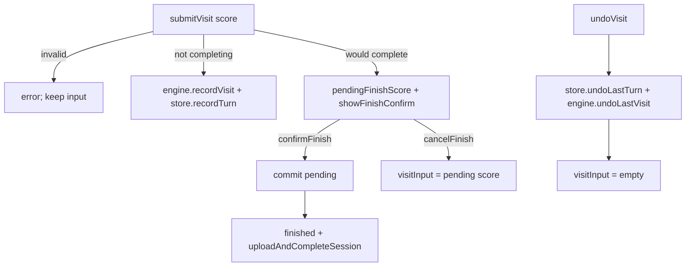

# Score Training Undo + Finish Confirm — Design

> **Date:** 2026-07-21
> **Status:** approved (brainstorming consensus)
> **Scope:** Undo last visit from `ScoreInput`; pending-completion gate + confirm modal before results.
> **Prerequisite:** `2026-07-21-score-training-play-ui-design.md`, `2026-07-17-score-training-flow-redesign.md`.
> **Out of scope:** Undo after results/upload; server-side turn correction; shared modal library; restoring score into input on normal undo.

---

## Context

The left keypad control in `ScoreInput.astro` shows an undo icon but is wired to `clearVisitInput()` (clear typed digits). Players cannot correct a mistaken submitted visit. Separately, a completing visit currently flips straight to the results modal and upload hard-gate, with no chance to fix the last score.

Turns for an active Score Training session live only in `$store.game.turns` until batch upload on complete/abandon, so in-play undo and a pending finish gate are client-only.

Brainstorming decisions:

| Topic | Choice |
| ----- | ------ |
| Approach | Pending-completion gate in the play factory (not record-then-rollback; not engine draft API) |
| Normal undo | Pop last committed visit; leave `visitInput` empty |
| Undo vs typed digits | Always undo last visit (discard any typed digits) |
| Post-results undo | Not supported |
| Completing submit | Do not commit; stash pending score; open finish-confirm modal |
| Confirm | Commit pending → existing results modal + upload path |
| Cancel | Discard pending; restore score string into `visitInput`; stay in play |

Authority: `07-Frontend/03-Alpine-Patterns.md`, `07-Frontend/05-Astro-Components.md`, `app/CLAUDE.md` TDD rules. Immutable completed gameplay (root invariant) is unaffected — corrections happen before upload.

---

## Scope

In scope:

- Wire `ScoreInput` left button to `undoVisit()` (aria-label “Undo last visit”; disable when unavailable)
- `undoVisit()` / `confirmFinish()` / `cancelFinish()` on `scoreTrainingPlay()`
- `pendingFinishScore` + `showFinishConfirm` state on the play factory
- Branch `submitVisit` for completing vs non-completing visits
- `game.store` `undoLastTurn()`
- `ScoreTrainingEngine` `undoLastVisit()`
- Finish-confirm overlay on `play/index.astro` (ExitModal / results-modal pattern)
- Unit tests in `score-training-play.data.test.ts` (+ store/engine tests as needed)
- `DECISIONS.md` one-liner for pending finish confirm before results

Out of scope:

- Undo after `finished === true` / mid-upload
- Changing delete-digit behavior
- Replacing `clearVisitInput` unless it becomes dead after rewiring (remove only if unused)
- Extracting a shared `FinishConfirmModal` component (inline overlay is enough for V1)
- Other game types

---

## Behavior

### Undo (keypad)

Preconditions: session in progress, no finish-confirm open, ≥1 committed turn.

Action: pop last turn from store and engine; set `visitInput = ""`; clear `error`.

Otherwise: no-op; button `:disabled`.

Digit editing stays on Delete (`deleteLast`). Undo is visit-level only.

### Submit

1. Validate integer score in `0..180` (existing); on failure leave input unchanged.
2. If visit would **not** complete the session (`engine.isComplete(turns.length + 1, timerExpired)` is false): `engine.recordVisit` → `store.recordTurn`; clear `visitInput`.
3. If visit **would** complete: do **not** commit; set `pendingFinishScore = score`; clear `visitInput`; set `showFinishConfirm = true`.

Completion check uses committed turns plus the candidate score (i.e. `turns.length + 1`), matching today’s “record then check length” semantics without mutating store until confirm.

### Finish confirm

- **Confirm:** commit pending via engine + store; clear pending/`showFinishConfirm`; set `finished = true`; run existing `uploadAndCompleteSession()`.
- **Cancel:** `visitInput = String(pendingFinishScore)`; clear pending/`showFinishConfirm`; stay in play.

While `showFinishConfirm`: keypad, submit, and undo are disabled (or no-ops). Only Confirm/Cancel are active.

---

## Architecture

| Piece | Responsibility |
| ----- | -------------- |
| `ScoreInput.astro` | Left button → `undoVisit()`; disable when no turns / confirm open / finished |
| `score-training-play.data.ts` | Pending state; branch submit; `undoVisit` / `confirmFinish` / `cancelFinish` |
| `game.store.ts` | `undoLastTurn()` — immutable pop (`turns = turns.slice(0, -1)`) |
| `ScoreTrainingEngine` | `undoLastVisit()` — pop internal `visits` so sequences stay aligned |
| `play/index.astro` | Finish-confirm overlay (Confirm / Cancel) |

Sequences stay correct because both store and engine pop the same last visit; new visits continue to use `startingSequence + visits.length + 1`.

---

## Edge cases

| Case | Behavior |
| ---- | -------- |
| Undo with zero turns | Disabled / no-op |
| Typed digits + Undo | Discard digits; pop last committed visit; empty input |
| Finish confirm open | Block keypad/submit/undo |
| MINUTES: timer expires during confirm | Pending still gates finish; Cancel returns to play with `timerExpired` already true; next completing submit re-opens confirm |
| Completing visit is the first (MINUTES after expiry) | Pending holds it; Cancel restores input with zero committed turns |
| Invalid score | Never opens confirm; never commits |

---

## Testing

TDD under `app/tests/` (mirroring `app/src/`), Vitest mocks only.

Required cases:

1. `undoVisit` pops store + engine and clears `visitInput`; no-op when empty.
2. Non-completing `submitVisit` commits and clears input (regression).
3. Completing `submitVisit` sets pending, does not commit, opens confirm.
4. `cancelFinish` restores `visitInput`, clears pending/confirm.
5. `confirmFinish` commits, sets `finished`, invokes upload path (API mocked).
6. Store `undoLastTurn` / engine `undoLastVisit` unit coverage.

No Vitest for `.astro` markup (D101).

---

## Decisions to record

One-liner in `DECISIONS.md`: Score Training completing visits use a client-side pending score + finish-confirm modal before results/upload; Cancel restores the score into the input without committing.

---

## Success criteria

- Undo corrects the last committed visit during play.
- Completing submit never jumps straight to results without confirm.
- Cancel leaves the player able to edit the score still in the input.
- Confirm preserves existing upload hard-gate behavior (D119).
- `npm test` covers the cases above; no schema/API changes.
