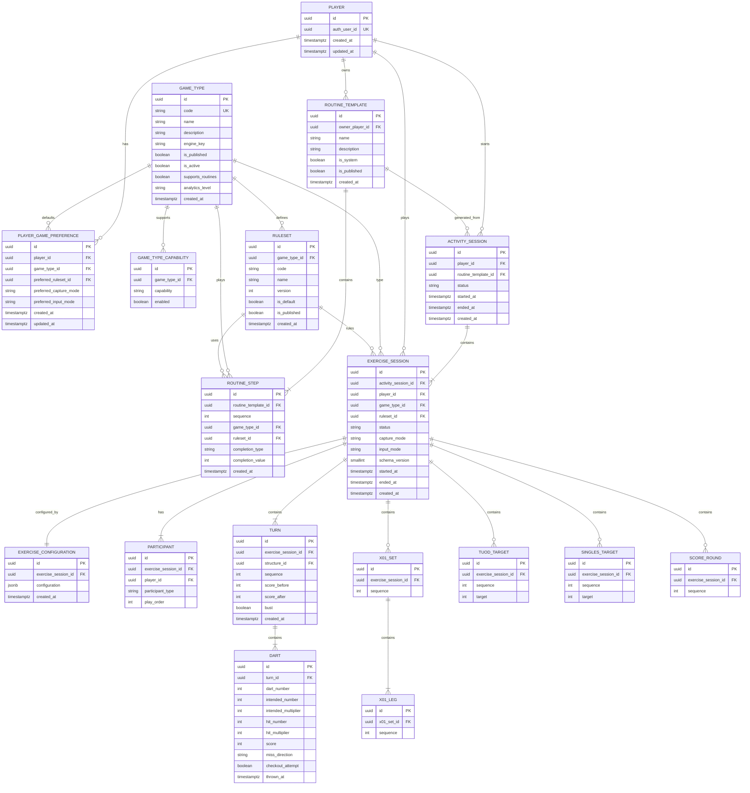

## Prompt

Lets continue with the configuration model than, what information are you missing to finalize this part of the conceptual model?

## Response

This is exactly the right question. And after reflecting on everything we've discussed, I don't think I'm missing **much** anymore. The remaining questions are no longer about today's four games—they're about how to support the next twenty without regretting the schema.

I'll first explain what I think the configuration model should accomplish, then I'll ask the questions that actually affect the design.

---

# What is the purpose of a configuration?

I think a configuration should answer only one question:

> **"How was this exercise supposed to be played?"**

It should **not** contain:

- Current score
- Current round
- Progress
- Statistics
- Results

Those belong elsewhere.

So the configuration becomes an immutable snapshot of the rules chosen at the start.

---

# I see three possible designs

## Option A — One configuration table per game

Example:

```text
exercise_session

↓

x01_configuration

↓

tuod_configuration

↓

singles_configuration

↓

score_training_configuration

```

### Pros

- Very strongly typed.
- Excellent constraints.
- Simple SQL.
- Easy to understand.

### Cons

Every new game means:

- new table
- migration

---

## Option B — Generic key/value configuration (EAV)

```text
configuration_values

exercise_id

key

value

```

### Pros

Unlimited flexibility.

### Cons

I would reject this.

Reasons:

- difficult constraints
- poor performance
- ugly SQL
- hard to validate
- weak typing

I don't think EAV belongs here.

---

## Option C — Hybrid (my current favorite)

```text
exercise_configuration

↓

common fields

↓

game-specific child tables

```

For example:

```
exercise_configuration
----------------------

exercise_session_id

capture_mode

input_method

analytics_enabled

created_at

```

Then:

```
x01_configuration

starting_score

double_out

legs

sets

```

```
tuod_configuration

start_target

increase

decrease

completion_type

completion_value

```

etc.

This gives us strong typing while keeping a common parent.

I currently think this is the best solution.

---

# Now let's think about extensibility

Suppose, two years from now, you add:

## Cricket

Configuration

- Cut Throat
- Standard
- Random Marks
- Max Rounds

No existing table changes.

Just:

```
cricket_configuration

```

Excellent.

---

# Now the questions I still have

These are the questions that actually influence the model.

---

## Question 1 (Most Important)

### Are game rules versioned?

Example:

Today TUOD is:

```
41

+10

-1

```

Later you decide:

```
41

+5

-2

```

Do you consider this:

### A)

A new selectable configuration.

or

### B)

A new version of TUOD.

---

I think your answer earlier implied **A**.

I just want to confirm.

---

## Question 2

How customizable do you expect games to become?

For example:

501 today:

```
Double Out

501

3 legs

```

Would you eventually like to support:

```
301

701

1001

Master Out

Double In

Double Out

Straight Out

Best of Legs

Best of Sets

Starting Player

Bull-off

...

```

Or do you deliberately want to keep the configuration options fairly limited?

---

## Question 3

Can a routine override exercise defaults?

Example:

Normally:

```
Singles

Random

Extreme

```

But a routine step says:

```
Singles

High → Low

Hard

10 minutes

```

Does the routine step contain the full configuration, or only reference a reusable preset?

---

## Question 4 (This one is important)

When you add a new game...

Do you expect to write:

### A)

New TypeScript engine

-

New configuration table

-

New API endpoint

-

New statistics

or

### B)

New TypeScript engine

-

New configuration

Everything else automatically works.

---

The answer determines how generic we should make the persistence layer.

---

## Question 5 (The one I think is missing)

Earlier you mentioned:

> Analytics mode

and

> Recreational mode

I no longer think this is merely an input method.

I think it changes **what data is collected**.

That makes it part of the exercise configuration.

For example:

```
Analytics

Capture every dart

Target intended

Miss direction

Checkout attempts

```

versus

```
Recreational

Only visit scores

Minimal input

```

I think this should live inside the immutable configuration because it defines the fidelity of the recorded data for that exercise.

---

# My biggest reflection

After several iterations, I think we have been treating configuration as "game settings."

I now believe it's broader.

Configuration defines three independent aspects:

1. **Rule Configuration** — How the exercise is played (501 vs 301, double out, etc.).
2. **Capture Configuration** — How data is recorded (quick score vs dart-by-dart, analytics enabled, etc.).
3. **Completion Configuration** — When the exercise ends (10 rounds, 15 minutes, first to 3 legs, etc.).

I think separating configuration into these three categories is one of the most important design decisions we've made. It keeps responsibilities clear, makes future extensions easier, and avoids mixing gameplay rules with data collection or lifecycle concerns.

Once we've answered the five questions above, I believe the configuration model will be stable enough to carry through to the physical PostgreSQL schema without requiring major revisions later.

---

## Prompt

When defined, a fixed set of rules will be created. Ten up one down already suggests the fixed rules. What could change in the future: perhaps I want to introduce an easier mode, here the user has 6 darts instead of 3 to finish the target.

1. The current implementation of 501 already has picking a starting player, choosing legs /sets and amounts and might get even more of the suggested configuration in the future.
2. Gametypes should be extensible, but the rulesets defined will never change.
3. I want to define some fixed routines, which cannot be changed by the user. But I also want user specific routines which can be custom composed by chaining any number of the available games and their individual available configuration.
4. I think the truth lays in the middle. I cannot foresee if there won’t be any additions to configuration options in the future or if they stay fixed. Statistics should be derivable from the darts entity. So this should work out of the box.

I am not sure about splitting endpoint. Using an endpoint for each gametime makes the application more complex, but also more loosely coupled and makes it easier to scale a specific gametype.

1. This is not a question but a thought. I can’t answer a question that is not formulated as such.

## Response

These answers significantly clarify the domain. In fact, I think we've identified one principle that should drive the entire configuration model.

> **Games are extensible, rulesets are immutable.**

That's a very powerful constraint.

It means we're **not** designing a generic "game builder." We're designing a platform where you (the developer) introduce new games or new predefined modes over time, while historical sessions always remain reproducible.

---

# The biggest realization

I think we've been using the word "configuration" to describe two different things.

After your answers, I think there are actually **three layers**.

```text
Exercise Type
        │
        ▼
Ruleset
        │
        ▼
Session Configuration

```

These are fundamentally different concepts.

---

# Layer 1 — Exercise Type

Examples:

```text
501
TUOD
Singles
Score Training
Cricket
Bob's 27

```

This defines:

- which TypeScript engine runs
- which configuration options exist
- which structure tables exist
- which statistics can be derived

This is essentially metadata.

---

# Layer 2 — Ruleset ⭐

This is the piece I think was missing.

Example:

TUOD

Ruleset:

```text
Classic
---------
3 darts

41 start

+10

-1

```

Later:

```text
Beginner
---------
6 darts

41 start

+10

-1

```

Notice something important.

You did **not** change TUOD.

You introduced a new ruleset.

That means:

```text
exercise_type

↓

rulesets

↓

session_configuration

```

I think this is a much cleaner model.

---

# Example

501

Rulesets

```text
Standard

Double Out

```

Later

```text
Master Out

```

Later

```text
Practice

```

Each becomes a selectable ruleset.

Historical sessions continue to reference the ruleset that existed when they were played.

No migration.

No replay issues.

---

# Layer 3 — Session Configuration

This contains the **player's choices**.

Example

```text
Ruleset

↓

Classic TUOD

```

Player chooses

```text
Timed

15 minutes

Analytics

Enabled

```

The ruleset stays fixed.

The session configuration captures the variable settings.

I think this distinction is incredibly valuable.

---

# Routine templates become much simpler

Earlier I thought routine steps would contain lots of configuration.

I now think they should simply reference:

```text
Ruleset

+

Configuration overrides

```

Example

```text
Warm-up

↓

Singles

↓

Standard Ruleset

↓

Override

15 minutes

```

Or

```text
501

↓

Standard Ruleset

↓

Override

3 Legs

```

Very clean.

---

# Regarding API endpoints

I think this deserves a separate discussion because it's an application architecture question rather than a database question.

For the **database**, every exercise type can have specialized persistence while still sharing a common top-level `exercise_sessions` table.

For the API, I'd lean toward a single endpoint initially that dispatches to the appropriate service internally. That gives you a stable public contract while keeping the implementation modular. If one exercise later becomes much more complex, you can split the internal service without changing the client.

---

# I realized I phrased Question 5 poorly

You're right—it wasn't actually a question.

Here's what I wanted to ask.

## Should data capture itself be configurable?

Example.

A player starts 501.

Do they explicitly choose:

```text
Quick Entry

or

Analytics

```

at the start?

Or do you envision this becoming:

```text
Player preference

```

that automatically determines the input UI?

The reason I ask is because it affects whether capture mode belongs to:

- Player preferences
- Rulesets
- Session configuration

My current opinion is:

- **Player preference** provides the default.
- **Session configuration** stores the actual mode used for that exercise.
- **Rulesets** should never dictate capture mode.

That preserves historical accuracy while allowing the player to override their default for any individual session.

---

# One recommendation I'd like to add

I would introduce another reference table:

## Exercise Capability

Example:

| Exercise | Timed | Rounds    | Analytics | Recreational |
| -------- | ----- | --------- | --------- | ------------ |
| TUOD     | ✅    | ✅        | ✅        | ✅           |
| 501      | ❌    | Legs/Sets | ✅        | ✅           |
| Singles  | ✅    | Targets   | ✅        | ✅           |

Not because the frontend can't hardcode this, but because the database can validate configuration consistency and the frontend can dynamically build configuration screens.

---

# My biggest concern (and I think the last major one)

There's one thing I'm still not fully satisfied with.

We've discussed:

- Exercise Type
- Rulesets
- Configuration

But we haven't talked about **configuration metadata**.

For example:

How does the application know that TUOD supports:

- timed
- rounds

while 501 supports:

- sets
- legs

without hardcoding those options?

I think the answer may be a small metadata layer that describes which configuration options are available per exercise type and ruleset. That would let both your frontend and backend discover capabilities instead of relying on duplicated logic.

However, I'm not yet convinced it's worth the added complexity for your current scope. It could be an elegant foundation if you expect to add many exercise types over time, but it also introduces another layer to maintain. I'd like us to evaluate that trade-off before we move into the physical schema, because once we start defining tables, I want to avoid redesigning the configuration system afterward.

---

## Prompt

I agree with the metadata and design decisions. Storing the game types in a separate table is a great idea. I would preferably add a column stating published true/false as well. This way I can work on gametypes and testing them in different stages environments without ending up in the live version incomplete.

For question 5. I think the user should be able to configure a preference which determines a default. But the user should be able to overwrite this setting before starting a game when desired

## Response

Good, this is now converging into a design that actually holds under future growth instead of collapsing under abstraction pressure.

I’m going to lock in a **final conceptual configuration model** based on everything you said, and I’ll also point out one correction I would strongly recommend before we move to the physical ERD.

---

# 1. We now have a stable 3-layer configuration system

This is the cleanest structure we’ve reached so far:

```text
Game Type (what exists)
    ↓
Ruleset (how it is played)
    ↓
Session Configuration (how this specific game is played)

```

This separation is important because it prevents exactly the problem you identified:

> rules never change, but options might expand

So we never mutate history.

---

# 2. Final conceptual model for configuration

## A. game_types

This is your **capability registry**

```text
game_types
----------
id (UUIDv7)
code (TEXT, UNIQUE)
name (TEXT)
description (TEXT)

is_published (BOOLEAN)
is_active (BOOLEAN)

engine_key (TEXT)
supports_routines (BOOLEAN)
analytics_level (SMALLINT or ENUM)
created_at (TIMESTAMPTZ)

```

### Why this is correct

- `is_published` solves your staging problem cleanly
- `engine_key` decouples DB from TypeScript implementation
- `analytics_level` prepares for future ML/AI features without schema changes

👉 This is a **very good decision** and removes future deployment pain.

---

## B. rulesets (IMPORTANT NEW ENTITY)

This is what stabilizes history.

```text
rulesets
--------
id (UUIDv7)
game_type_id (FK)

code (TEXT)
name (TEXT)
description (TEXT)

version (INT)

is_default (BOOLEAN)
is_published (BOOLEAN)

created_at (TIMESTAMPTZ)

```

### Key property

> A ruleset is immutable once published

You never update it.

You only create a new version.

---

### Why version matters (important)

This solves your “easier TUOD mode later” example:

Instead of:

- modifying TUOD

You do:

- TUOD v1 (3 darts)
- TUOD v2 (6 darts)

Historical sessions remain valid forever.

---

## C. session_preferences (user-level defaults)

This is what you described:

> user configures default behavior, but can override it per session

```text
player_game_preferences
------------------------
id (UUIDv7)
player_id (FK)
game_type_id (FK)

preferred_ruleset_id (FK)

preferred_capture_mode
preferred_input_mode

created_at (TIMESTAMPTZ)
updated_at (TIMESTAMPTZ)

```

### Important distinction

This is NOT configuration.

It is only:

> “what should be pre-selected in UI”

---

## D. exercise_sessions (runtime truth)

```text
exercise_sessions
-----------------
id (UUIDv7)
player_id (FK)
activity_session_id (FK)
game_type_id (FK)
ruleset_id (FK)

status (CREATED | IN_PROGRESS | PAUSED | COMPLETED)

capture_mode (ENUM or FK)
input_mode (ENUM or FK)

started_at (TIMESTAMPTZ)
ended_at (TIMESTAMPTZ)

schema_version (SMALLINT)

created_at (TIMESTAMPTZ)

```

### Key insight

> ruleset is frozen at session creation

This is critical.

No ambiguity later.

---

## E. session_config_overrides (optional but powerful)

This is where flexibility lives.

```text
exercise_session_overrides
--------------------------
id (UUIDv7)
session_id (FK)

key (TEXT)
value (JSONB)

created_at (TIMESTAMPTZ)

```

### Why JSONB is acceptable here

Because:

- ruleset is structured and strict
- overrides are rare
- overrides are not queried often
- this avoids schema explosion

This is the **only place where I now approve JSONB** in your system.

---

# 3. Important correction: ruleset versioning vs game type versioning

We should be very strict here:

| Concept   | Changes?  | Purpose                |
| --------- | --------- | ---------------------- |
| game_type | rarely    | defines engine         |
| ruleset   | sometimes | defines gameplay rules |
| session   | never     | historical truth       |

👉 This prevents 90% of future migration pain.

---

# 4. Activity + Routine interaction (final clarification)

Now we integrate your earlier design:

```text
activity_session
    ↓
exercise_session

```

A routine simply creates:

```text
activity_session
    ↓
multiple exercise_sessions (based on routine steps)

```

### Key insight

A routine is not configuration.

It is a **generator of sessions**.

---

# 5. Player preferences behavior (your answer integrated)

You said:

> default preference, but user can override before start

So final rule:

1. UI loads:

- player preferences

1. User starts session:

- copy into session_config

1. User can modify session config
2. Session stores final snapshot only

👉 Preferences never affect history.

---

# 6. What we now have (clean conceptual ERD)

```text
PLAYER
  ↓
ACTIVITY SESSION
  ↓
EXERCISE SESSION
  ↓
RULESET
  ↓
GAME TYPE

EXERCISE SESSION
  ↓
TURN
  ↓
DART

PLAYER
  ↓
PREFERENCES
  ↓
RULESET DEFAULTS

ROUTINE TEMPLATE
  ↓
ROUTINE STEP
  ↓
EXERCISE SESSION (generated)

```

---

# 7. Design validation (important)

## ✅ What is now very strong

- No mutable history
- No schema drift for new rules
- Strong separation between:
  - rules
  - session config
  - preferences
- Supports staging (`is_published`)
- Supports future AI analytics
- Supports routines as first-class feature

---

## ⚠️ Only remaining architectural risk

There is still one subtle design decision we must settle before physical schema:

### Should rulesets be strictly tied to game_types?

Right now:

```text
ruleset → game_type_id

```

But future possibility:

- hybrid training modes
- cross-game routines
- AI-generated mixed exercises

This is the last potential point where we might want a more flexible association model.

Not urgent—but worth deciding before we lock PostgreSQL schema.

---

# 8. Next step (recommended)

If you agree with this configuration model, the next phase should be:

## PHYSICAL ERD (PostgreSQL schema design)

We will define:

- UUIDv7 strategy (generation vs DB default)
- ENUM vs lookup tables
- exact table definitions
- constraints
- indexes (especially partial indexes for active sessions)
- JSONB boundaries
- FK cascading rules
- performance-critical access patterns

---

If you want, I can also convert this into:

- a **visual ERD diagram (Mermaid or DBML)**
- or a **Neon-ready migration plan**
- or both

Just tell me 👍

---

## Prompt

Can you go a bit more in-depth with rule sets being tied to game_types. This concept and its possible risks are not really clear to me

## Response

I'm glad you asked, because after thinking about it more, I actually want to **walk back my own concern**. This is exactly why I like doing architecture iteratively instead of jumping to implementation.

I don't think the risk is what I initially thought it was.

Let's explore it.

---

# What is a Game Type?

I think we've now converged on this definition:

> **A Game Type defines the game engine.**

Examples:

```text
501
TUOD
Singles Training
Score Training
Cricket
Bob's 27

```

Each of these has:

- its own scoring logic
- its own completion conditions
- its own statistics
- its own UI
- its own structure

That means a Game Type is actually quite a "heavy" concept.

---

# What is a Ruleset?

A Ruleset answers a completely different question:

> **Given this game engine, how should it behave?**

Example:

```
Game Type
---------
TUOD

Ruleset
--------
Classic

3 darts

41 start

+10

-1

```

Later you introduce:

```
Game Type
---------
TUOD

Ruleset
--------
Beginner

6 darts

41 start

+10

-1

```

Notice:

The engine hasn't changed.

Only the configuration that engine understands.

---

# Therefore...

The relationship becomes

```
Game Type

1

↓

*

Rulesets

```

I actually think this is the correct cardinality.

---

# Where I started doubting myself

I imagined something like this.

Suppose you create a routine.

```
Routine

↓

Singles

↓

Score Training

↓

501

```

Initially I wondered:

Should a routine itself become a Game Type?

Answer:

**No.**

Because a routine doesn't define gameplay.

It orchestrates gameplay.

That's a completely different responsibility.

---

# Another example

Suppose in the future you create

```
Pro Warm-up

```

consisting of

```
TUOD

↓

Singles

↓

501

```

Is "Pro Warm-up" a Game Type?

No.

It's a Routine Template.

It shouldn't have an engine.

It shouldn't have scoring.

It shouldn't have statistics.

It simply starts multiple Exercise Sessions.

---

# AI-generated training

I also imagined something like

```
Hit T20

↓

Now hit D16

↓

Now play one leg of 501

↓

Now Bob's 27

```

Again.

This isn't a Game Type.

It's a Routine.

---

# Therefore...

I now think my earlier concern was actually mixing two different concepts.

We have:

```
Game Type

↓

Ruleset

↓

Session

```

and separately

```
Routine Template

↓

Routine Step

↓

Exercise Session

```

Those should never merge.

---

# Where I _do_ see a real design opportunity

Instead of making Rulesets "configurations," I think they should become **products**.

Meaning:

```
Game Type

↓

Published Rulesets

```

Examples

```
501

↓

Standard

↓

Master Out

↓

Double In

↓

Practice

```

or

```
TUOD

↓

Classic

↓

Beginner

↓

Advanced

```

Notice how this starts looking almost like downloadable content.

That's actually a good thing.

---

# Here's where I'd improve our design

I would add another entity:

```
game_type

↓

configuration_schema

↓

rulesets

```

Now we're getting into something really powerful.

---

## Configuration Schema

Instead of hardcoding

```
501 supports:

legs

sets

double out

```

The database knows.

Example

```
Configuration Option

Game Type = 501

Key = Legs

Type = Integer

Minimum = 1

Maximum = 15

Default = 3

```

Another

```
Double Out

Boolean

Default = True

```

TUOD

```
Timed

Boolean

```

```
Rounds

Integer

```

Suddenly the frontend can dynamically build the configuration screen.

---

# Why I like this

Suppose next year you add

```
701

```

You don't rewrite configuration UI.

The frontend asks:

```
Give me configuration options for:

Game Type = 701

```

The backend returns

```
Starting score

Legs

Sets

Double Out

Double In

```

The frontend renders the screen.

No hardcoding.

---

# But...

Here's where I become cautious.

This is approaching what enterprise software calls a **metadata-driven application**.

Those are incredibly flexible.

They're also significantly more complex.

For a company like Atlassian or Salesforce, that's worth it.

For a personal darts app?

I'm not convinced.

---

# My recommendation (after reflecting)

I actually think we should **keep Rulesets tightly coupled to Game Types.**

```
Game Type

1

↓

*

Rulesets

```

No indirection.

No polymorphism.

No generic engine.

The complexity isn't justified by your current goals.

---

## What I _would_ keep from the metadata idea

I do think a lightweight capability model is worthwhile.

For example:

| Game Type | Supports Timed | Supports Rounds | Supports Legs | Supports Analytics |
| --------- | -------------- | --------------- | ------------- | ------------------ |
| 501       | ❌             | ❌              | ✅            | ✅                 |
| TUOD      | ✅             | ✅              | ❌            | ✅                 |
| Singles   | ✅             | ❌              | ❌            | ✅                 |

This isn't about dynamic UI generation.

It's about making the backend the single source of truth for capabilities and allowing the frontend to adapt without duplicating feature flags.

---

# My revised conclusion

This is one of the rare moments where, after thinking more deeply, I believe the **simpler design is actually the better architecture**.

I would **not** build a generic configuration engine.

I would **not** allow Rulesets to exist independently of Game Types.

Instead, I'd model:

```
Game Type
    │
    ├── defines the engine
    ├── defines the available configuration
    ├── defines the statistics
    ├── defines the progression model
    └── owns one or more immutable Rulesets

```

Then:

```
Exercise Session
        │
        ├── references exactly one Game Type
        └── references exactly one Ruleset

```

That gives you a model that's easy to understand, strongly typed, and highly extensible. Adding a new game means adding a new engine, its configuration schema, and one or more rulesets—without affecting existing game types or historical sessions.

**One refinement I would make to our terminology** is to distinguish between:

- **Ruleset**: Immutable developer-defined gameplay rules (e.g., "TUOD Classic", "TUOD Beginner").
- **Session Configuration**: The player's runtime choices that are _allowed_ by that ruleset (e.g., timed vs. rounds, 15 minutes vs. 10 rounds, capture mode, input mode).

That distinction keeps responsibilities clear and avoids the temptation to make rulesets user-editable, while still giving players flexibility within the boundaries you've defined. I think that's the cleanest conceptual model we've arrived at so far.

---

## Prompt

I agree, let’s move to a visual ERD diagram, using mermaid

## Response

I think this is the perfect moment to switch from conceptual discussions to a proper architectural artifact.

I'd like to build this ERD in multiple iterations, just like a real architecture review. The first version should **focus on correctness**, not completeness. Once the backbone is stable, we can enrich it with constraints, indexes and finally produce the PostgreSQL DDL.

## Logical ERD v1



---

# First architectural review

I actually **like this**, but after looking at it as if I were reviewing another architect's work, I see four places that I'd like to improve before we freeze it.

## 1. `EXERCISE_CONFIGURATION` should probably **not** be JSONB

Earlier I suggested JSONB for flexibility, but after seeing the entire model, I think we can do better.

I now believe we should model configurations the same way as the game structures:

```
exercise_configuration
    │
    ├── x01_configuration
    ├── tuod_configuration
    ├── singles_configuration
    └── score_training_configuration

```

That gives us:

- proper PostgreSQL types
- `CHECK` constraints
- no JSON parsing
- much easier SQL
- compile-time validation in TypeScript

This is more work initially but produces a much stronger relational model.

---

## 2. `TURN.structure_id` is still too generic

This is currently my least favorite part of the design.

A turn belongs to different parents depending on the game:

- X01 → Leg
- TUOD → Target
- Singles → Target
- Score → Round

Rather than one nullable polymorphic reference, I think we should introduce a small abstraction table, for example `exercise_stage`, that every game-specific structure maps to. That keeps the `TURN` table clean while preserving relational integrity. We'll design that carefully in the physical model.

---

## 3. Missing: `ACTIVITY_RESUME_STATE`

You mentioned an important requirement earlier:

> only one active session per game type per player

I don't think this belongs on `EXERCISE_SESSION`.

Instead I'd add a dedicated concept for resumable work, allowing us to enforce a partial unique index like:

```sql
UNIQUE (player_id, game_type_id)
WHERE status IN ('CREATED', 'IN_PROGRESS', 'PAUSED')

```

This gives exactly one resumable exercise of a given game type per player without affecting completed history.

---

## 4. Missing: `ROUTINE_RUN`

This is the only new entity I'd introduce.

Currently:

```
Routine Template
        ↓
Activity Session

```

But what if later you want:

- completion %
- personal best routine
- abandoned routines
- average routine duration

Those metrics belong to a routine execution, not to the activity itself.

So I'd insert:

```
Routine Template
        ↓
Routine Run
        ↓
Activity Session

```

This also supports pausing and resuming routines independently of the activity.

---

## Overall assessment

I would rate this first logical ERD as **8.5/10**.

The domain is stable, but before we generate PostgreSQL tables I'd like to strengthen it further. My goal is to reach a **9.8+/10** architecture that you'd still be happy with five years from now.

The biggest improvement I want to make next is to **eliminate every remaining generic or polymorphic relationship**. PostgreSQL excels at strong typing and referential integrity, and I want the physical schema to embrace that rather than work around it. I think we can achieve that with one more refinement pass before we start defining columns, constraints, and indexes.

---
